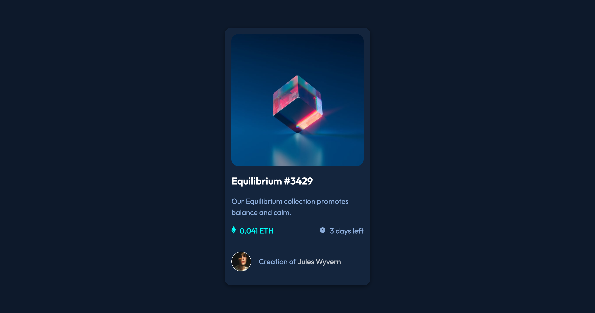

# Frontend Mentor - NFT preview card component solution

This is a solution to the [NFT preview card component challenge on Frontend Mentor](https://www.frontendmentor.io/challenges/nft-preview-card-component-SbdUL_w0U). Frontend Mentor challenges help you improve your coding skills by building realistic projects. 

## Table of contents

- [Overview](#overview)
  - [The challenge](#the-challenge)
  - [Screenshot](#screenshot)
  - [Links](#links)
- [My process](#my-process)
  - [Built with](#built-with)
  - [What I learned](#what-i-learned)
- [Author](#author)

## Overview

### The challenge

Users should be able to:

- View the optimal layout depending on their device's screen size
- See hover states for interactive elements

### Screenshot



### Links

- [Solution](https://github.com/ryanthayes/fem-nft-preview-card-component)
- [Live URL](https://ryanthayes.github.io/fem-nft-preview-card-component)


## My process

### Built with

- Semantic HTML5 markup
- CSS custom properties
- Flexbox
- Mobile-first workflow

### What I learned

This took a little figuring out. I haven't worked much with position relative and absolute. I had used the psuedo element ::before on a previous project, but wasn't sure I could get over the top of another element (image). Then I needed a color, too. I tried having both as ::before, but it didn't work. So, I just threw up a hail mary and tried one as ::before and one as ::after. It worked!

```css
 .nft__image-container::after {
    content: url(images/icon-view.svg);
    position: absolute;
    top: 50%;
    left: 50%;
    transform: translate(-50%, -50%);
    opacity: 0;
}

.nft__image-container::before {
    content: "";
    position: absolute;
    top: 0;
    width: 100%;
    height: 100%;
    background-color: var(--clr-accent-400-alpha);
    opacity: 0;
}
```

## Author

- Github - [@ryanthayes](https://github.com/ryanthayes)
- Frontend Mentor - [@ryanthayes](https://www.frontendmentor.io/profile/ryanthayes)
